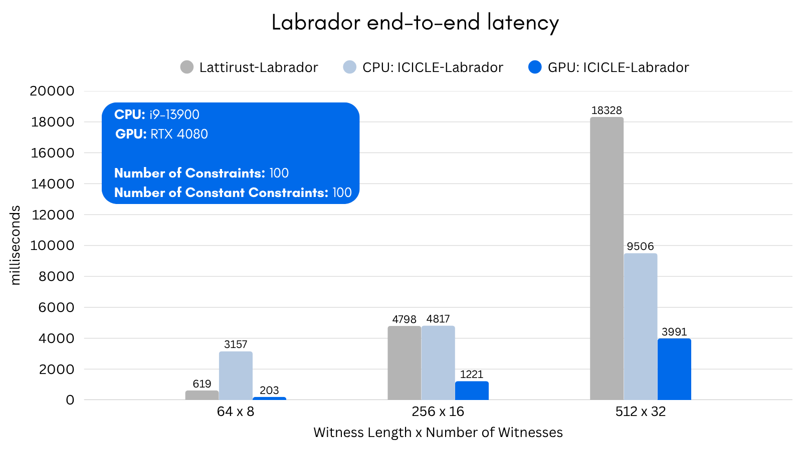

# Labrador with Custom CUDA NTT


> **⚠️ WARNING**: This code has not been audited. Use at your own risk.

This repository contains a compact, end-to-end demo of **LaBRADOR** — the first practical _lattice-based_ zk-SNARK (CRYPTO 2023) - built on top of **ICICLE v4**. LaBRADOR produces ~50 kB proofs without a trusted setup and is secure under the Module-SIS assumption, making it resistant to both classical and _quantum_ attacks.

ICICLE ships highly-tuned GPU and CPU kernels for FFT/NTT, polynomial arithmetic and lattice primitives. Thanks to those kernels the prover can run unchanged on a laptop CPU _or_ a CUDA-capable GPU and enjoy order-of-magnitude speed-ups.

## 项目说明

本项目在 Ingonyama 的 fast-labrador-prover 基础上，实现了自定义的 CUDA NTT，替换了 ICICLE 的默认 NTT 实现。


## 命令行选项

```bash
# 只使用 ICICLE 默认 CUDA 后端
./run.sh -d CUDA

# 启用自定义 NTT
./run.sh -d CUDA -c

# 启用自定义 MatMul
./run.sh -d CUDA -m

# 启用自定义 VecOps
./run.sh -d CUDA -v

# 启用自定义 MiscOps
./run.sh -d CUDA -o

# 启用全部自定义实现
./run.sh -d CUDA -c -m -v -o
```

## 原理说明

Custom NTT 实现了标准的 FFT 算法，针对有限域进行了优化：

1. **Forward NTT**: 
   - 输入自然顺序 → Coset multiplication → Bit-reversal → DIT butterfly → 输出自然顺序

2. **Inverse NTT**:
   - 输入 bit-reversed → DIF butterfly → Divide by N → Inverse coset multiplication → 输出自然顺序

3. **Negacyclic 转换**:
   - 通过 coset multiplication 将 cyclic NTT 转换为 negacyclic NTT
   - 等价于在 ψ 的奇数次幂上求值


## Credits


```cpp
// SHOW_STEPS creates a print output listing every step performed by the Prover and the time taken
constexpr bool SHOW_STEPS = true;
```

All functions and objects are documented in code.

## Performance



